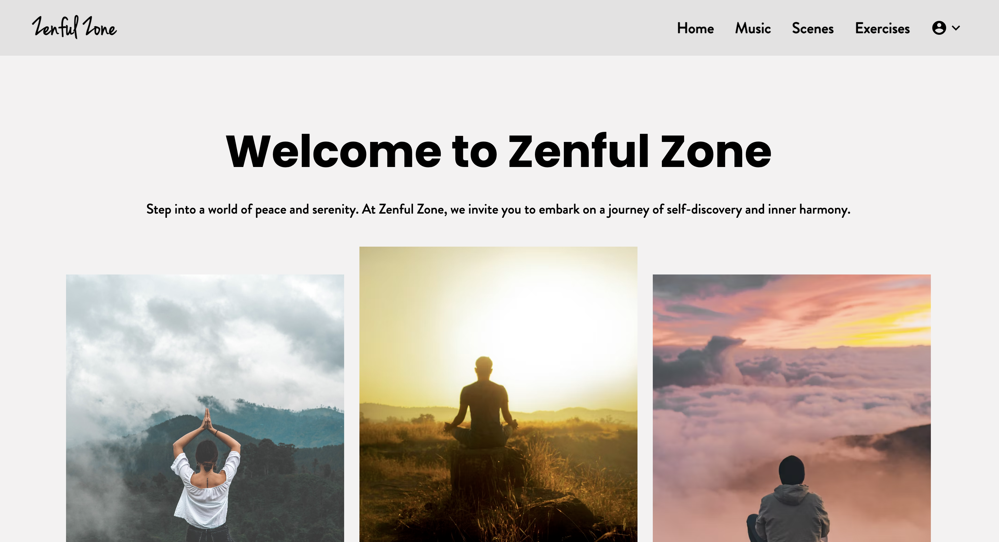
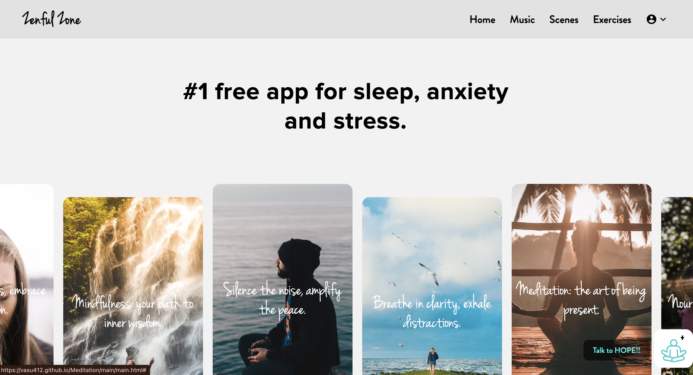
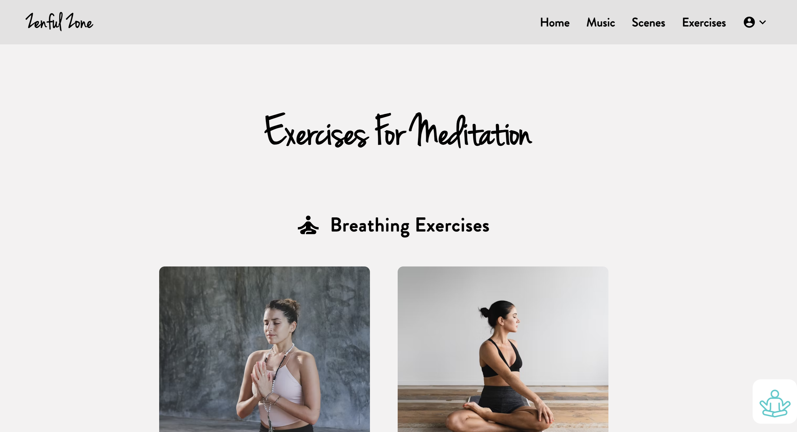
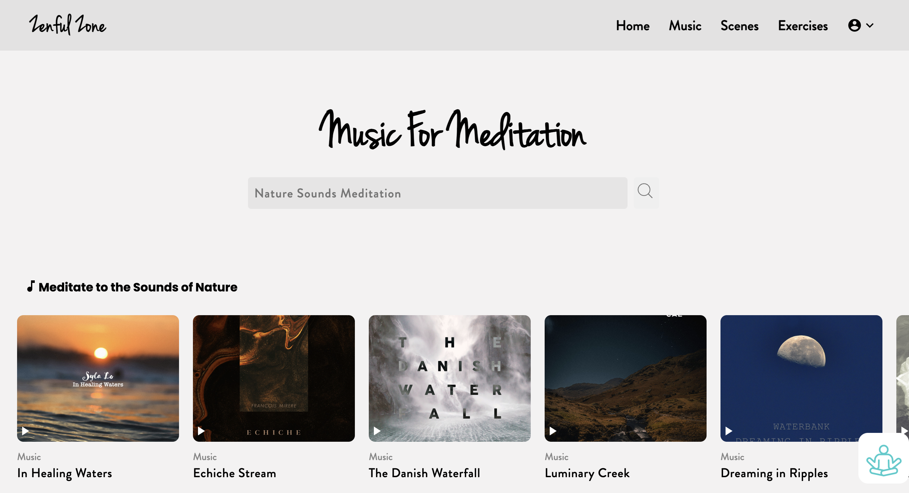
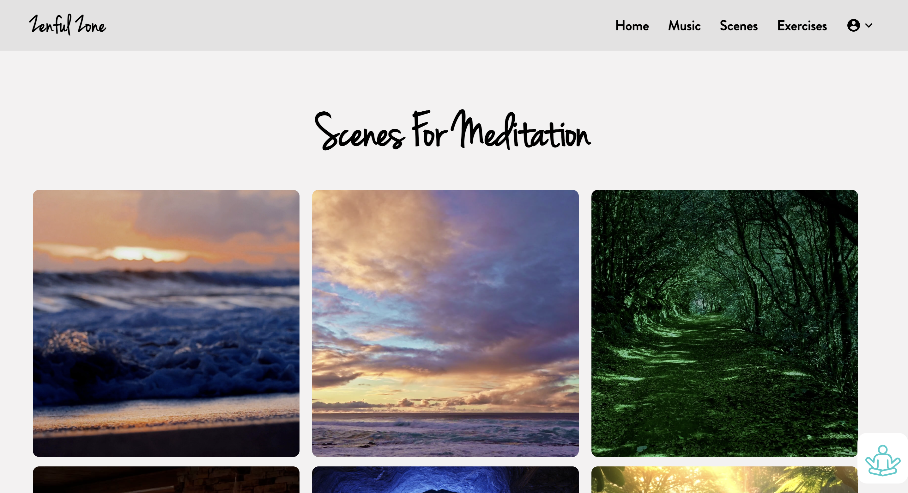
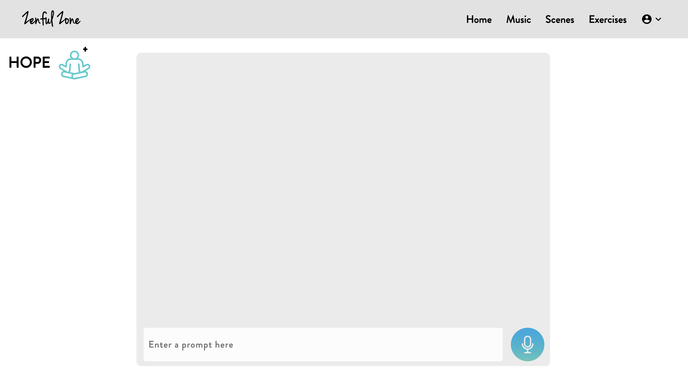

# ZenfulZone.com 🧘‍♂️

## HOSTED LINK OF OUR PROJECT
Explore our meditation website by visiting [https://vasu412.github.io/Meditation/](https://vasu412.github.io/Meditation/)

###  <u>Table of Contents:</u>

1. [INTRODUCTION](#🌟-introduction)
2. [FEATURES](#🧘‍♀️features)
3. [TECHNOLOGIES](#💻technologies)
4. [INSTALLATION](#📲installation)
5. [CHALLENGES](#🎢challenges)
6. [REFERENCES](#📚references)
7. [WEBSITE UI](#✨website-ui)
8. [LICENSE](#🔗license)
9. [CONCLUSION](#🌿conclusion)

## 🌟 INTRODUCTION
<i>Welcome to the Meditation Website Project! This project aims to create a serene and immersive online space dedicated to meditation and mindfulness practices. Whether you're a seasoned meditator, someone seeking stress relief, or simply curious about mindfulness, our website offers an inviting platform to explore various meditation techniques and resources.

By embarking on this project, you'll delve into the art of web design while cultivating a deeper understanding of the principles of meditation and mindfulness. Through intuitive interfaces, calming visuals, and interactive features, we aim to provide users with a tranquil digital sanctuary where they can nurture their mental well-being and find inner peace.

Throughout this README file, you'll find detailed instructions on navigating the website, information about the technologies used in its development, and insights into the challenges faced and lessons learned during the project's creation.

Let's embark on this journey together, embracing serenity and mindfulness in the digital realm!</i>

## 🧘‍♀️FEATURES

#### 1. Guided Meditations:
<ul>Access a collection of guided meditation sessions led by experienced instructors, catering to various experience levels and meditation styles.</ul>

#### 2. Relaxing Visuals:
<ul>Immerse yourself in soothing visual environments designed to evoke feelings of calmness and tranquility, perfect for enhancing meditation sessions.</ul>

#### 3. Mindfulness Exercises:
<ul>Explore mindfulness exercises and techniques to cultivate present-moment awareness and promote mental clarity and emotional balance.</ul>

#### 4. Meditation Timers:
<ul>Utilize customizable meditation timers to structure your meditation sessions, with options for interval bells, background sounds, and session tracking.</ul>

#### 5. Breathwork Guides:
<ul>Discover the transformative power of breathwork through step-by-step guides and exercises aimed at fostering relaxation, stress reduction, and mental clarity.</ul>

#### 6. Calm Music:
<ul>Experience tranquility and serenity with our curated collection of calming music tracks, specially selected to enhance your meditation practice and promote relaxation.</ul>

#### 6. Hope:
<ul>Discover the transformative power of our AI-driven Hope feature. Powered by advanced machine learning algorithms, Hope provides personalized guidance, inspiration, and encouragement to support you on your journey towards inner peace and well-being.</ul>

## 💻TECHNOLOGIES  

 #### 1. HTML  
<ul>HTML is utilized for structuring web pages, organizing content, and creating intuitive user interfaces.</ul>

 #### 2. CSS  
<ul>CSS is employed for styling and enhancing the visual appeal of the website, ensuring a harmonious and aesthetically pleasing user experience.</ul>

#### 3. JAVASCRIPT 
<ul>JavaScript enhances interactivity and functionality, enabling features such as guided meditations, interactive timers, and dynamic content updates.</ul>

 #### 4. FONT AWESOME 
<ul>Font Awesome provides a comprehensive library of icons to enhance visual elements and user interface components across the website.</ul>

 #### 5. GOOGLE FONTS AND ICONS
<ul>Google Fonts and Icons enrich typography and visual design, offering a diverse selection of fonts and scalable vector icons to elevate the website's aesthetics.</ul>

## 📲INSTALLATION 
To experience our meditation website, follow these simple steps:
<ol>
<li>Open your preferred web browser.
<li>Visit the hosted link [https://vasu412.github.io/Meditation/](https://vasu412.github.io/Meditation/).
<li>Explore the various features and resources available for meditation and mindfulness practices.
</ol>

## 🎢CHALLENGES :runner:
Developing the Meditation Website presented several challenges and learning opportunities:

#### 1. User Experience Design:
<ul>Creating a serene and user-friendly interface required careful consideration of layout, color schemes, and interactive elements to promote relaxation and ease of navigation.</ul>

#### 2. Content Curation:
<ul>Curating high-quality meditation resources and mindfulness exercises while maintaining relevance and diversity posed challenges in content selection and organization.</ul>

#### 3. Technical Implementation:
<ul>Implementing interactive features such as guided meditations, meditation timers, and community forums required proficient use of JavaScript and integration with backend services.</ul>

#### 4. Performance Optimization:
<ul>Ensuring smooth performance and responsiveness across devices and screen sizes demanded meticulous optimization of code, assets, and server resources.</ul>

## ✨WEBSITE UI 
 #### 1. INTRODUCTION PAGE UI
 
##### UI Description:<i> "The first page welcomes users with serene visuals and intuitive navigation, inviting them to explore meditation resources and community features."</i>

#### 2. HOME PAGE UI
 
 ##### UI Description:<i> "The home page page offers a curated selection of meditation quotes, music and different scenes."</i>

 #### 3. MINDFULNESS EXERCISES
 
 ##### UI Description:<i> "Discover mindfulness exercises and techniques to cultivate present-moment awareness and foster emotional well-being."</i>

 #### 4. CALM MUSIC
 
 ##### UI Description:<i> "Immerse yourself in a tranquil ambiance with our collection of calming music. Let soothing melodies and gentle rhythms guide you on a journey of relaxation and mindfulness during your meditation sessions."</i>

#### 5. MEDITATING SCENES

##### UI Description:<i> "Embark on a visual journey of serenity with our meditating scenes. Explore breathtaking landscapes and tranquil settings designed to evoke a sense of peace and tranquility, perfect for enhancing your meditation practice."</i>

#### 6. HOPE

##### UI Description:<i> "Experience a profound sense of optimism and empowerment with our AI-driven Hope feature. Delve into personalized messages of encouragement, inspiration, and resilience tailored to uplift your spirits and guide you towards a brighter tomorrow."</i>

## 📚REFERENCES 
<ul type=circle>
<li>Insight Timer
<li>Calm
<li>Headspace
</ul>

## :link:LICENSE
<ul>
<li>There is no license for this project as it is created under major project @Geekster. 
<li>You are free to use and modify the code based on your requirements.
</ul>

## 🌿CONCLUSION
In conclusion, the Meditation Website Project offers a tranquil oasis in the digital landscape, providing users with a sanctuary for mindfulness, relaxation, and inner peace. By combining intuitive design, immersive visuals, and interactive features, we aim to empower individuals on their journey of self-discovery and well-being.

Through challenges and triumphs, our team has learned invaluable lessons in web design, user experience, and the profound impact of mindfulness practices on human flourishing. We invite you to join us in this transformative journey, embracing serenity and mindfulness one breath at a time.

May this meditation website serve as a beacon of light and tranquility in an ever-changing world. Namaste. 🙏
